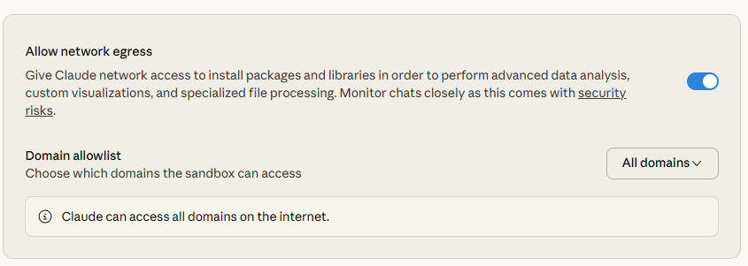

# Getting Started with Spotify API Skill

## Prerequisites

- Python 3.8 or higher
- Spotify account (Free or Premium)
- Claude Desktop (if using with Claude)

## Quick Setup (3 Steps)

### 1. Enable Network Access in Claude Desktop

⚠️ **REQUIRED** - The skill needs to access api.spotify.com

1. Open **Claude Desktop** → **Settings** → **Developer**
2. Toggle **"Allow network egress"** to **ON** (blue)
3. Choose domain access:
   - **"All domains"** (easiest), OR
   - **"Specified domains"** → add `api.spotify.com` (more secure)



### 2. Install Dependencies

```bash
pip install -r requirements.txt
```

This installs:
- `requests` - For HTTP API calls
- `python-dotenv` - For loading credentials
- `cairosvg` - For SVG → PNG conversion (cover art generation)
- `pillow` - For image optimization (cover art generation)

### 3. Get Spotify Credentials

1. Go to [Spotify Developer Dashboard](https://developer.spotify.com/dashboard)
2. Create a new app
3. Copy your **Client ID** and **Client Secret**
4. Add redirect URI: `http://127.0.0.1:8888/callback`
5. Create `spotify-api/.env` from the example:
   ```bash
   # Copy the example file
   cp spotify-api/.env.example spotify-api/.env

   # Edit with your credentials
   code spotify-api/.env
   ```

   Update these values:
   ```env
   SPOTIFY_CLIENT_ID=your_client_id_here
   SPOTIFY_CLIENT_SECRET=your_client_secret_here
   ```

### 4. Get Your Refresh Token

Run the token generator:

```bash
python get_refresh_token.py
```

This will:
1. Open your browser to authorize with Spotify
2. Generate a refresh token
3. Display it in your terminal

Copy the refresh token and add it to `spotify-api/.env`:

```env
SPOTIFY_REFRESH_TOKEN=your_refresh_token_here
```

### 5. Test It!

```bash
python spotify-api/scripts/test_credentials.py
```

You should see: **✅ ALL TESTS PASSED!**

## What's Next?

### Use the Skill

```python
from spotify_client import create_client_from_env

# Initialize client
client = create_client_from_env()
client.refresh_access_token()

# Get your playlists
playlists = client.get_user_playlists()
for playlist in playlists:
    print(f"📋 {playlist['name']} - {playlist['tracks']['total']} tracks")
```

### Create Playlists

```python
from playlist_creator import PlaylistCreator

creator = PlaylistCreator(client)

# Create playlist from an artist
playlist = creator.create_from_artist(
    artist_name="Radiohead",
    playlist_name="Best of Radiohead",
    limit=25
)
```

### Generate Cover Art 🎨 (NEW!)

> **⚡ UNIQUE**: Claude cannot generate images natively, but this skill can!

```python
from cover_art_generator import CoverArtGenerator

# Initialize generator
art_gen = CoverArtGenerator(
    client_id=os.getenv("SPOTIFY_CLIENT_ID"),
    client_secret=os.getenv("SPOTIFY_CLIENT_SECRET"),
    access_token=client.access_token
)

# Generate and upload cover art
art_gen.create_and_upload_cover(
    playlist_id=playlist['id'],
    title="Best of Radiohead",
    subtitle="Essential Tracks",
    artist="radiohead"  # Uses Radiohead's signature colors
)

# Or test locally first
art_gen.generate_cover_art(
    title="Summer Vibes",
    theme="summer",
    output_path="test_cover.png"
)
```

**Features:**
- Automatic text wrapping for long titles
- 20+ mood themes, 15+ genre colors, 10 artist palettes
- Large fonts (60-96px) optimized for thumbnails
- WCAG 2.1 accessibility compliant

See [USER_GUIDE.md - Cover Art Generation](USER_GUIDE.md#cover-art-generation) for complete documentation.

## Common Issues

### "Network error" or "Connection refused"

The skill now automatically detects network issues and provides helpful guidance:

```
❌ NETWORK ACCESS BLOCKED

The Spotify API skill cannot access api.spotify.com.

🔧 FIX: Enable network egress in Claude Desktop:
   1. Open Claude Desktop → Settings → Developer
   2. Toggle 'Allow network egress' to ON (blue)
   3. Set 'Domain allowlist' to either:
      • 'All domains' (easiest), OR
      • 'Specified domains' and add 'api.spotify.com'
```

If you see this message:
1. Follow the steps above in Claude Desktop settings
2. Restart Claude Desktop
3. Try running your script again

### "Missing credentials"
→ Check that your `.env` file has all required values:
  - `SPOTIFY_CLIENT_ID`
  - `SPOTIFY_CLIENT_SECRET`
  - `SPOTIFY_REFRESH_TOKEN`

### "Token expired"
→ Run `python get_refresh_token.py` again to get a new refresh token

## Documentation

- **[USER_GUIDE.md](USER_GUIDE.md)** - Complete API documentation
- **[spotify-api/SKILL.md](spotify-api/SKILL.md)** - Skill reference

## Support

Having issues? Check:
1. Network egress is enabled in Claude Desktop
2. All credentials are in `spotify-api/.env`
3. Dependencies are installed: `pip install -r requirements.txt`
4. Your Spotify app redirect URI matches: `http://127.0.0.1:8888/callback`

For detailed help, see [USER_GUIDE.md](USER_GUIDE.md#troubleshooting)
