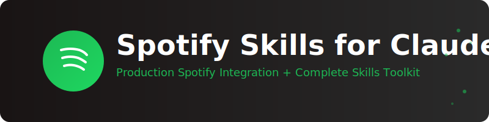

<div align="center">

<picture>
  <source media="(prefers-color-scheme: dark)" srcset=".github/banner-dark.svg">
  <source media="(prefers-color-scheme: light)" srcset=".github/banner-light.svg">
  
</picture>

<br/><br/>

[](https://opensource.org/licenses/Apache-2.0)
[](https://www.python.org/downloads/)
[](https://support.claude.com/en/articles/12512198-how-to-create-custom-skills)
[](https://developer.spotify.com/documentation/web-api)
[](https://github.com/fabioc-aloha/spotify-skill/releases/tag/v0.9.0)
[](https://github.com/fabioc-aloha/spotify-skill/discussions)

**Spotify Skills for Claude - Production Spotify Integration + Complete Skills Toolkit**

[Quick Start](#-quick-start) • [Features](#-features) • [Documentation](#-documentation) • [Examples](#-examples) • [Tools](#-tools)

</div>

---

## 🎯 Overview

**Spotify Skills for Claude** is a comprehensive development platform that combines:

- 🎵 **Production Spotify API Skill** - Fully-featured example with OAuth 2.0 and 40+ methods
- 🛠️ **Automated Development Tools** - Create, validate, and package skills effortlessly
- 📚 **Educational Resources** - Complete guides teaching skill creation from first principles
- 📋 **Official Specifications** - The authoritative Agent Skills Spec v1.0
- 🎨 **6 Curated Examples** - Real-world skill patterns from Anthropic

Whether you want to **use** the Spotify skill or **create your own skills**, this project provides everything you need.

---

## ✨ Features

### 🎵 Spotify API Skill

**Primary Use:** Create and manage Spotify playlists, search music, control playback

**⚡ UNIQUE CAPABILITY: Image Generation**
> This skill can **generate images** - something Claude cannot do natively! It creates custom SVG-based cover art and converts them to PNG images, bypassing Claude's built-in limitation.

- **🎨 Custom Cover Art Generation**: Auto-generate thumbnail-readable playlist cover images with:
  - **SVG → PNG image generation** (Claude cannot generate images natively!)
  - **Automatic text wrapping** for long playlist titles
  - **20+ mood themes** (summer, chill, energetic, romantic, nostalgic, etc.)
  - **15+ genre color schemes** (rock, jazz, electronic, blues, indie, etc.)
  - **10 artist-specific moods** (Beatles, Queen, Pink Floyd, Nirvana, etc.)
  - **Large typography** (60-96px fonts) optimized for thumbnail readability
  - **80% text width** for maximum visibility at all sizes
  - **Smart element spacing** to prevent overlap
  - **WCAG 2.1 compliant** - Accessibility-first design with high contrast
  - **Comprehensive LLM guide** - Detailed instructions for quality generation
- **Intelligent Playlist Creation**: Create playlists by artist, theme, lyrics, or song list
- **Playlist Management**: Create, update, delete, add/remove tracks
- **Search & Discovery**: Find tracks, artists, albums, playlists
- **Playback Control**: Play, pause, skip, volume, shuffle, and repeat
- **User Data**: Access profile, top items, and listening history
- **Authentication**: OAuth 2.0 with automatic token refresh
- **Network Detection**: Automatic error messages for blocked access
- **Environment Setup**: `.env` file support with example template

**Cover Art Features:**
- Large typography (60-96px) optimized for thumbnail visibility
- Text spans 80% of cover width for readability
- Smart element spacing prevents overlap
- Theme/genre/artist-appropriate color schemes
- Auto-optimization for Spotify's size requirements

**For Advanced App Development:**
- Robust error handling with `SpotifyAPIWrapper`
- Credential validation with clear error messages
- Data export for React/static web apps (see `ADVANCED_USAGE.md`)
- **User Data**: Access profile, top items, and listening history
- **Recommendations**: AI-powered music discovery

### 🛠️ Development Tools

```bash
# Create a new skill from template
python tools/init_skill.py my-new-skill --path ./

# Validate skill structure and content
python tools/validate_skill.py ./my-new-skill

# Package skill for distribution
python tools/package_skill.py ./my-new-skill ./dist
```

### 📚 Learning Resources

- **Complete Guide** - Step-by-step skill creation process
- **Interactive Workbook** - Fill-in-the-blank planning templates
- **6 Example Patterns** - From minimal to advanced complexity
- **Official Spec** - Agent Skills Specification v1.0

---

## 🚀 Quick Start

> 📘 **New to this project?** Start with **[GETTING_STARTED.md](GETTING_STARTED.md)** for a simple 5-step setup guide!

### Using the Spotify Skill (Summary)

1. **Enable network access** in Claude Desktop (Settings → Developer → Allow network egress)
2. **Install dependencies**: `pip install -r requirements.txt` (includes image generation libraries!)
3. **Get Spotify credentials** from [developer.spotify.com/dashboard](https://developer.spotify.com/dashboard)
4. **Get refresh token**: `python get_refresh_token.py`
5. **Test**: `python spotify-api/scripts/test_credentials.py`
6. **✨ Generate cover art**: `python spotify-api/test_cover_art.py` (Creates actual image files!)

**Full instructions**: [GETTING_STARTED.md](GETTING_STARTED.md)

### Creating Your Own Skills

1. **Initialize a new skill**:
   ```bash
   python tools/init_skill.py my-api-skill --path ./
   ```

2. **Study example patterns**:
   - Browse `examples/` for 6 curated patterns
   - Read `Guide/SKILL_CREATION_GUIDE.md` for principles

3. **Implement and validate**:
   ```bash
   # Develop your skill
   code my-api-skill/SKILL.md

   # Validate structure
   python tools/validate_skill.py ./my-api-skill

   # Package for distribution
   python tools/package_skill.py ./my-api-skill
   ```

---

## 📖 Documentation

### Main Documentation

| Document | Description |
|----------|-------------|
| [GETTING_STARTED.md](GETTING_STARTED.md) | **Start here** - Simple 5-step setup guide |
| [USER_GUIDE.md](USER_GUIDE.md) | Complete usage guide with examples |

### Skill Creation

| Document | Description |
|----------|-------------|
| [Guide/SKILL_CREATION_GUIDE.md](Guide/SKILL_CREATION_GUIDE.md) | Complete skill creation tutorial |
| [Guide/SKILL_CREATION_WORKBOOK.md](Guide/SKILL_CREATION_WORKBOOK.md) | Interactive planning templates |
| [Guide/ADVANCED_SKILL_EXAMPLES.md](Guide/ADVANCED_SKILL_EXAMPLES.md) | 5 detailed skill patterns |
| [agent_skills_spec.md](agent_skills_spec.md) | Official Agent Skills Spec v1.0 |

### Tools & Examples

| Document | Description |
|----------|-------------|
| [tools/README.md](tools/README.md) | Development tools documentation |
| [examples/README.md](examples/README.md) | 6 curated skill patterns |
| [examples/EXAMPLES_REFERENCE.md](examples/EXAMPLES_REFERENCE.md) | Detailed pattern analysis |

---

## 🎨 Examples

This project includes documentation for **6 curated skill patterns** from the [Anthropic Skills repository](https://github.com/anthropics/skills):

| Pattern | Complexity | Best For |
|---------|-----------|----------|
| **template-skill** | ⭐ Minimal | Quick start, learning basics |
| **internal-comms** | ⭐⭐ Simple | Multi-mode workflows |
| **theme-factory** | ⭐⭐ Medium | Reference libraries |
| **brand-guidelines** | ⭐⭐⭐ Medium | Visual/template skills |
| **mcp-server** | ⭐⭐⭐ Advanced | Technical guides |
| **slack-gif-creator** | ⭐⭐⭐⭐ Advanced | Complex toolkits |

Plus the **Spotify API skill** as a production-ready API integration example!

See [examples/README.md](examples/README.md) for detailed pattern comparison.

---

## 🤝 Contributing

We welcome contributions! Whether you're fixing bugs, improving docs, or creating new examples - your help makes this project better.

### Quick Contribution Guide

1. **🐛 Report bugs** - [Open an issue](https://github.com/fabioc-aloha/spotify-skill/issues/new?template=bug_report.yml)
2. **💡 Suggest features** - [Request a feature](https://github.com/fabioc-aloha/spotify-skill/issues/new?template=feature_request.yml)
3. **📖 Improve docs** - Fix typos, clarify instructions, add examples
4. **🔧 Submit code** - Fork, code, test, and open a PR
5. **🎨 Share skills** - Add your example skill to `examples/`

### Getting Started

```bash
# Fork and clone
git clone https://github.com/YOUR-USERNAME/spotify-skill.git
cd spotify-skill

# Set up environment
python -m venv .venv
.venv\Scripts\activate  # Windows
pip install -r spotify-api/requirements.txt

# Make changes and validate
python tools/validate_skill.py ./spotify-api

# Open PR!
```

**Full guidelines**: [CONTRIBUTING.md](CONTRIBUTING.md)

### Priority Areas

- 🐛 [Bug fixes](https://github.com/fabioc-aloha/spotify-skill/labels/bug)
- 📖 Documentation improvements
- 🎨 New example skill patterns
- ✨ Feature enhancements

**Join the discussion**: [GitHub Discussions](https://github.com/fabioc-aloha/spotify-skill/discussions)

---

## 🛠️ Tools

### Automated Development Utilities

Located in `tools/` directory:

| Tool | Purpose |
|------|---------|
| **init_skill.py** | Create new skills from template with proper structure |
| **validate_skill.py** | Validate SKILL.md format, YAML frontmatter, naming conventions |
| **package_skill.py** | Package skills as distributable .zip files |

### Usage Examples

```bash
# Create a new skill
python tools/init_skill.py weather-api --path ./skills

# Validate before distribution
python tools/validate_skill.py ./skills/weather-api

# Package for sharing
python tools/package_skill.py ./skills/weather-api ./dist
```

---

## 📂 Project Structure

```
spotify-skill/
├── spotify-api/              # Production Spotify skill
│   ├── SKILL.md             # Main skill documentation
│   ├── scripts/             # Python API wrapper (40+ methods)
│   └── references/          # API and auth guides
├── tools/                   # Development utilities
│   ├── init_skill.py        # Skill initializer
│   ├── validate_skill.py    # Skill validator
│   └── package_skill.py     # Skill packager
├── examples/                # Curated skill patterns
│   ├── README.md            # Pattern comparison
│   └── EXAMPLES_REFERENCE.md # Detailed analysis
├── Guide/                   # Educational content
│   ├── SKILL_CREATION_GUIDE.md
│   ├── SKILL_CREATION_WORKBOOK.md
│   └── ADVANCED_SKILL_EXAMPLES.md
└── agent_skills_spec.md     # Official specification
```

---

## 🎓 Learning Paths

### Beginner (2-3 hours)
1. Read `Guide/SKILL_CREATION_GUIDE.md` sections 1-3
2. Browse `examples/README.md` for pattern overview
3. Study the Spotify skill as a complete example

### Intermediate (4-6 hours)
1. Complete `Guide/SKILL_CREATION_WORKBOOK.md`
2. Deep-dive `examples/EXAMPLES_REFERENCE.md`
3. Create your first skill using the tools

### Advanced (2-3 hours)
1. Compare multiple patterns from `examples/`
2. Study Spotify skill's production architecture
3. Implement complex skills with mixed patterns

---

## 🔒 Security

This project includes proper security practices:

- ✅ `.env` files for credentials (never committed)
- ✅ OAuth 2.0 authorization code flow
- ✅ Automatic token refresh
- ✅ `.gitignore` for sensitive files
- ⚠️ Never commit API credentials to version control

---

## 📜 License

This project integrates content from multiple sources:

- **Spotify Skill Code**: Custom implementation (use freely)
- **Development Tools**: Apache License 2.0 (from [Anthropic Skills](https://github.com/anthropics/skills))
- **Agent Skills Spec**: Apache License 2.0 (from Anthropic)
- **Example Documentation**: Apache License 2.0 (referencing Anthropic Skills)

See [INTEGRATION_SUMMARY.md](INTEGRATION_SUMMARY.md) for complete licensing details.

---

## 🙏 Acknowledgments

Special thanks to:

- **Anthropic PBC** - For open-sourcing the Agent Skills system and exemplar skills
- **Spotify** - For providing the comprehensive Web API
- **Claude** - For the amazing AI capabilities that make skills possible

---

## 🔗 Links

- **Official Claude Skills Docs**: https://support.claude.com/en/articles/12512198-how-to-create-custom-skills
- **Anthropic Skills Repository**: https://github.com/anthropics/skills
- **Spotify Web API**: https://developer.spotify.com/documentation/web-api
- **Agent Skills Blog Post**: https://anthropic.com/engineering/equipping-agents-for-the-real-world-with-agent-skills

---

## 💬 Support

- 📖 Read the [complete documentation](USER_GUIDE.md)
- 🐛 [Report issues](https://github.com/fabioc-aloha/spotify-skill/issues)
- 💡 [Join discussions](https://github.com/fabioc-aloha/spotify-skill/discussions)
- 🚀 [View changelog](CHANGELOG.md)
- 🤝 [Contributing guidelines](CONTRIBUTING.md)

---

<div align="center">

**Built with ❤️ for the Claude Skills community**

⭐ Star this repo if you find it helpful!

**Current Release**: [v0.9.0](https://github.com/fabioc-aloha/spotify-skill/releases/tag/v0.9.0) • [Download Skill](https://github.com/fabioc-aloha/spotify-skill/releases/download/v0.9.0/spotify-api.skill)

</div>
